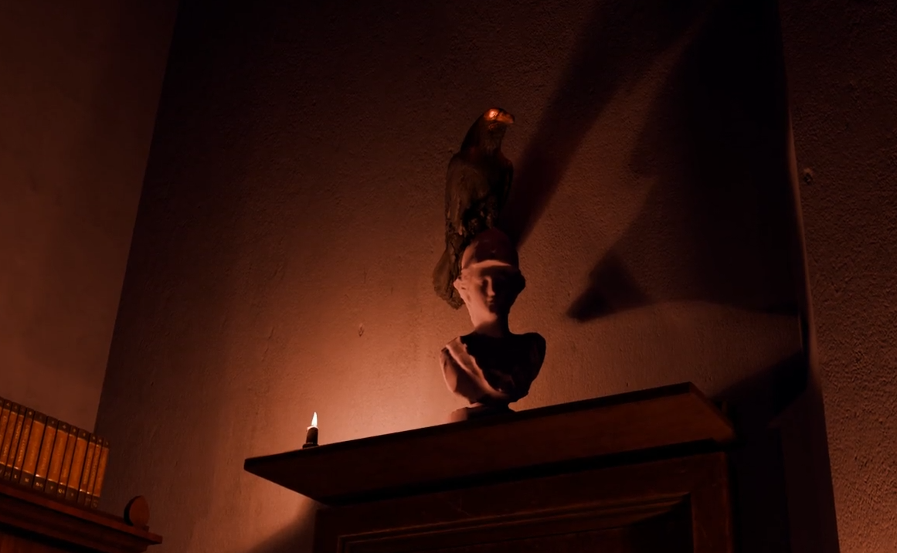
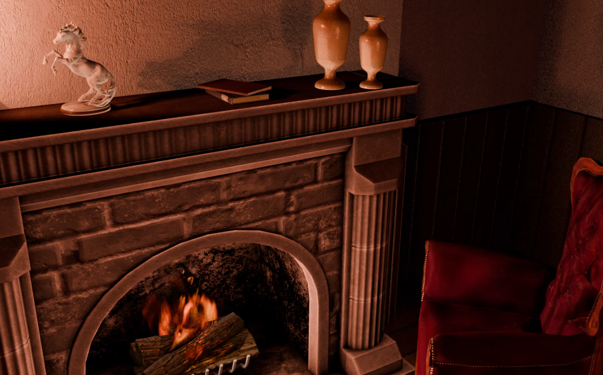

<h1> The Raven animations </h1>

For the <a href="../projects/0001_raven.html">Raven project</a> I had to create several animations in Blender using freely available 3D models, materials and textures.

    The entire game takes place inside a singular room. As such, all animations take place in this one scene. For optimization and to make the iterative process better, I duped the scene multiple times, with certain objects removed or hidden if they were not needed. I made the room myself and filled it with various objects that suited the setting.

    The final renders were done using EEVEE, if we had had more time we probably could have achieved slightly better results using a pathtracing pipeline instead.

    
    

As the used assets are not my own, credits are in order and this is the place for it: <a href="0000_credits.html">credits</a>.

