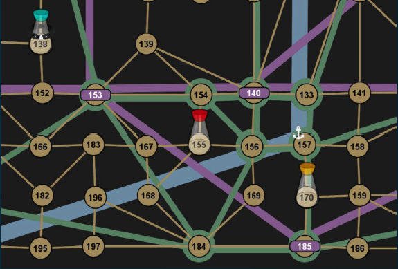
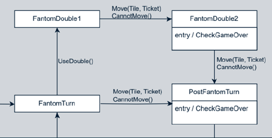

The full text of the thesis is available <a href="https://dspace.cuni.cz/handle/20.500.11956/202587">here</a> and the repository <a href= "https://github.com/tengu-blue/Fantom-Games">here</a>.

The goal was to ideally cover all the extensions of the board game, but that proved to be way out of scope for the thesis. As such, the game's core is prepared for future extensions. 

The base game was fully implemented including the opponents. I made a custom search algorithm, inspired by DFS due to the sheer number of possible states the game could be in. Instead of implementing an algorithm like Monte Carlo search, I opted for my own solution to see if it would be viable. The core idea is trying to assign values to states based on how likely they are to lead to victory, based on information that is available to the players.

The game uses a mechanic of hidden movement, so the core idea behind the state evaluation is in predicting where the players could currently be.

I also made custom art for the game to avoid legal issues with using someone else's art. 

