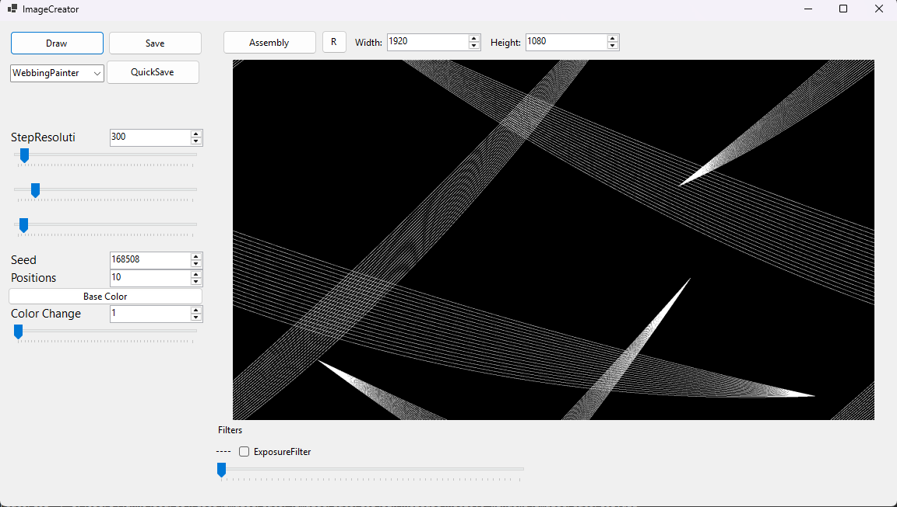

Initially I wrote a basic C# program which could load a specified Assembly, from which a painter type could be selected to draw into an image of a specified size. The Assembly contains the actual definition for the painters. I chose this kind of architecture to practice working with reflection in C#, but also it's more loosely coupled this way.

The formal-ish self-imposed requirements for each creation are:
- a piece of code that can generate infinitely many similar images
- the generated images must cover at least a two-monitor setup
- the images should loop on all sides seamlessly

All of these are more like guidelines and might be broken.

Eventually I wanted more control in my creative process and faster iteration. I created a GUI application which can load the Assembly in much the same fashion. Since this loading is dynamic, the Assembly can be rebuilt and reloaded all on runtime. The application also allows for manual variable manipulation via controls like sliders or number entries, which can directly affect the drawing process. Below is a snippet from the current version of the app.

The application is WIP, I might provide a link to the source code at some point in the future.

---

# Gallery




  

  


